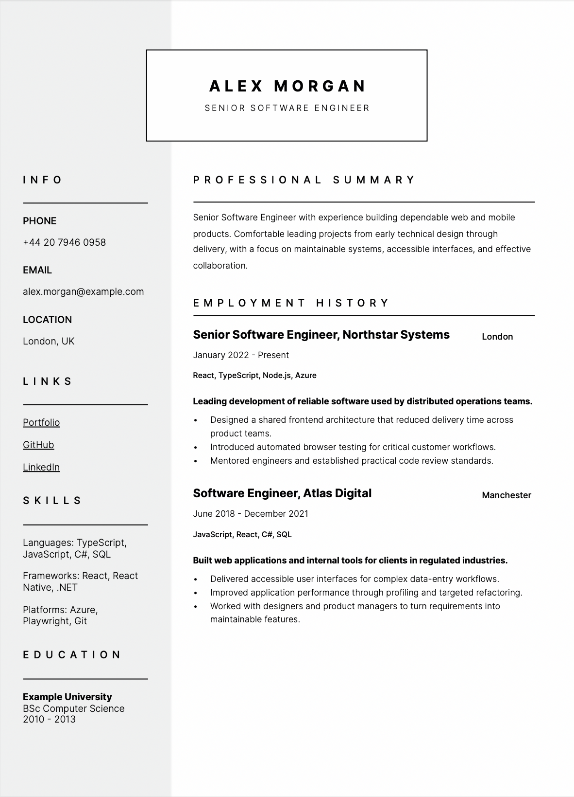

# Markdown CV Generator

Generate a styled PDF CV from a Markdown file using Handlebars and Playwright.

## Example



## Requirements

- Node.js 20 or newer
- npm

## Setup

```bash
npm install
npx playwright install chromium
cp Resume.example.md Resume.md
```

Edit `Resume.md` with your own details, then generate the PDF:

```bash
npm run build
```

The generated file is written to `dist/resume.pdf`.

`Resume.md` and `dist/` are ignored by Git so personal information and generated files are not committed.

## Custom Input

Pass another Markdown file without copying it into the project:

```bash
npm run build -- /path/to/resume.md
```

You can also set `RESUME_SOURCE`:

```bash
RESUME_SOURCE=/path/to/resume.md npm run build
```

## Markdown Format

The file uses YAML frontmatter for structured CV data and Markdown for the profile section. See `Resume.example.md` for all supported fields:

- `name` and `title`
- `contact`
- `links`
- `skills`
- `education`
- `experience`

Each experience entry supports a role title, company, location, period, technology summary, description, and bullet points.

## Customising The Theme

- Edit `src/style.css` for layout, typography, and colours.
- Edit `src/template.html` to change the document structure.
- Replace the Inter font files in `src/fonts/` if the CSS font declarations are updated as well.
